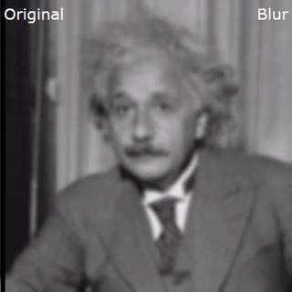
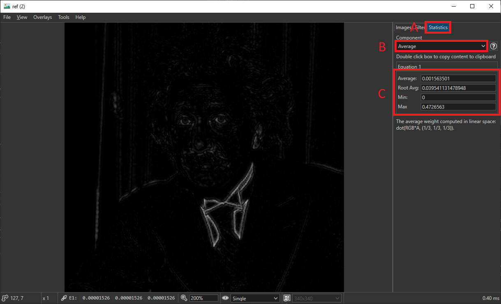
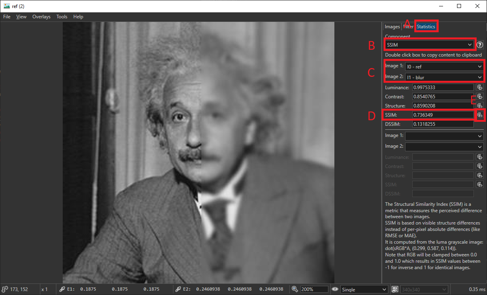
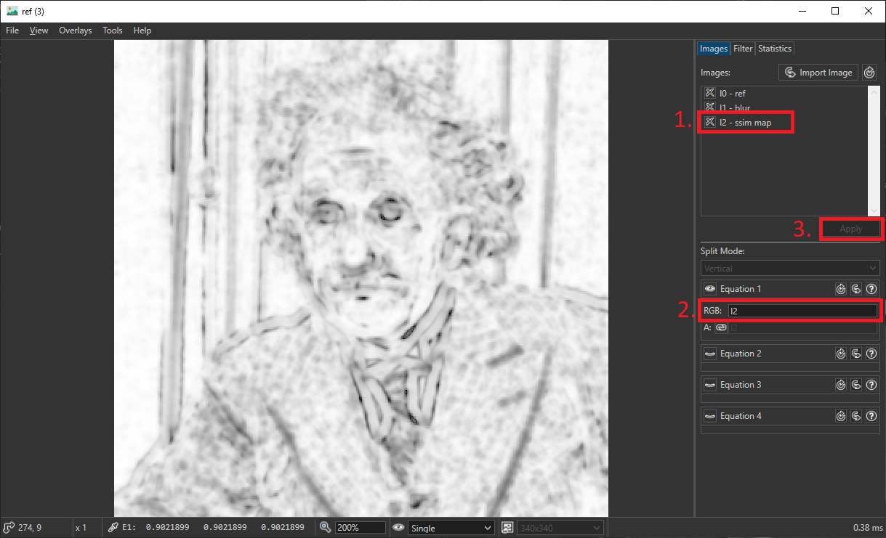
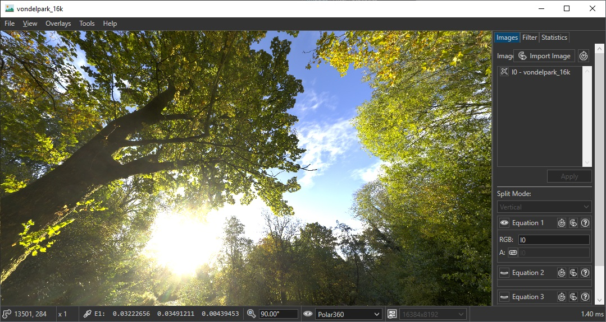

# Getting Started Guide

## Overview

* [Import Images](#compare-images)
* [Image Equations](#image-equations)
* [Export](#export)
* [Filter](#filter)
* [Statistics](#statistics) (MSE, SSIM)
* [Videos](#videos)
* [Cubemaps and 360 degree images](#cubemaps-and-360-degree-images)
* [3D Images](#image-3d)
* [Further Reading](#further-reading)

# Import Images

Images can be imported via File->Import (ctrl+i) in the menu bar or by using drag and drop. 
The imported images will be displayed on the right side of the editor in the "Images" tab:

* A: List of imported images
* B: Position of the mouse cursor in the image
* C: Color at the mouse cursors position (default: linear color values from 0.0 to 1.0). If you want to change the display format to 0-255, go to View->PixelDisplay in the menu and select 'byte (sRGB)'
* D: Zoom level (can be changed with the mouse wheel)

# Compare Images

When you import more than one image, you can compare them side by side in the editor (Images need to be the same size):

* A: Click the 'eye' icon to toggle the visibility of another image equation. This equation will then be displayed on the right side of the cursor. The first equation will be on the left side of the cursor
* B: Change the image equation to 'i2', 'i3', 'i4' etc. to display a specific image from the import list. Apply the changes by hitting the 'Apply' button (C)
* D: The pixel colors of the second equation will be displayed next to the pixel colors of the first equation

You can compare up to four images in the image viewer. The position of the first, second, third and fourth image will be: top left, top right, bottom left, bottom right (relative to the cursor).
You can also fix the comparison position by double-clicking a position inside the image. This can be undone by double-clicking again.

If you work with .hdr files, you can adjust the exposure with the '+' and '-' keys. The current exposure is displayed in the status bar on the bottom (here: 'x1').

# Image Equations

The image equations can be used for per-pixel calculations. In the following example, the difference of two imported images in visualized:

Here, the third equation states 'I0-I1' which subtracts the pixel colors of I1 from I0. Alternatively, you can use 'abs(I0 - I1)' to display the absolute error or '(I0-I1)^2' to display the squared error. For more information and examples on the image equations, please refer to the [Equation Manual](equation.md).

Beware of a few things:
* Negative values will be displayed as if they were positive if View->DisplayAbsoluteValues is enabled (default).
* All values will be clamped between 0.0 and 1.0 in the status bar if any of the sRGB display modes are active. The default 'decimal' display mode will show negative numbers.

# Export

Before exporting, make sure that only a single image equation is visible (disable them by hitting the 'eye' symbol).
Select File->Export in the menu bar to start exporting:
1. Select a destination in the "Save as" dialog. Make sure to select the correct file type in the dropdown (.png .hdr etc.)
2. In the "Export" dialog you can select the desired pixel format and enable cropping if desired. The format specifies which components are saved (R=Red, G=Green, B=Blue, A=Alpha). If you work with a colored image without transparency, RGB8_SRGB should be the correct format. If you work with a grayscale image R8_SRGB can be sufficient. If you work with linear data (like normal maps or height fields) you might want to select a different data type (UNorm, SNorm, UFloat, SFloat). If you are not familiar with the different types of images formats you can refer to the [OpenGL wiki](https://www.khronos.org/opengl/wiki/Image_Format).

If you have made minor changes to the input image and you want to overwrite the image without changing the format, you can select the File->Overwrite from the menu bar.

The File->AnimatedDiff feature can generate an animed image comparison. For this, exactly two images need to be visible:

# Filter

Filter are HLSL compute shader that can be imported by the ImageViewer. Only a single function needs to be implemented that will be called for each pixel of the image. User defined parameters can be set from within the GUI. Some filter, like the gaussian blur, are already implemented and can be imported via the filter tab:

* A: switch to the filter tab and open a filter via 'Add Filter'
* B: press 'Apply' to apply the changes
* C: You can change the filter user parameters in the menu below

For more information on how to write your own filter, please refer to the [Filter Manual](filter_manual.md).

# Statistics

## MSE and RMSE

Accumulated per-pixel statistics can be retrieved from the Statistics tab on the right side:

* A: The statistics tab
* B: The type of statistic. Here: Average weights the red, blue and green channel equally with 1/3, as described in the text below C. Luminance would weight the image based on the perceived brightness. More information about the individual types can be found in the [Statistics Manual](statistics.md)
* C: The accumulated per-pixel statistics. Average shows the average pixel color of the image. Min and Max are the minimum and maximum values of the image.

This example shows how to calculate the *mean squared error (MSE)* of the two einstein images from the [Image Equations](#image-equations) section above. Here, the image equation (Equation 1) was set to `(i0 - i1)^2` to obtain the squared distance of each pixel. The MSE can then be read from the 'Average' box in the statistics tab (here: `0.00156`). The *root mean squared error (RMSE)* can be read from the 'Root Average' box.

## SSIM

The [Structural Similarity (SSIM) index](https://www.cns.nyu.edu/pub/eero/wang03-reprint.pdf) can be determined in the statistics tab as well:

* A: The statistics tab
* B: Select 'SSIM' here
* C: Select the two images to compare (equations can also be used).
* D: The average SSIM value is displayed here. The three components of SSIM are shown above (Luminance, Contrast and Structure). The interpretation is shown below:

|SSIM|Interpretation|
|----|--------------|
|1   |Images are identical|
|0   |Images have no relation|
|-1  |Images are inversed|

* E: The per-pixel maps can also be imported into the image list by clicking on the import button next to the statistics value. The SSIM map of the two example images is shown below:

# Videos

Common video files (mp4, mov, mpeg, avi, flv, webm, mpeg, mkv, vmv) and animated gif files can be imported as well. In this case, the files will be interpreted as *texture 2D arrays* which are natively supported by image formats like dds, ktx and ktx2.
After the import, a dialog will pop up, in which you can specify the range of frames that should be imported. Beware that long and high-resolution videos can not be imported as a whole, because the *texture 2D array* does only support up to 2048 layers/frames. Furthermore, each frame will be stored in an uncompressed format so the gpu can run out of memory rather quickly.

Tip: Consider using 'Frame skip' in the import dialog, if your video is too long or you run out of gpu memory. This setting will only import every Xth frame.

An example of the video interface is shown below:

The important controls can be found in the status bar on the bottom. From left to right:
* Configure the playback FPS
* Play and Pause the video
* Go to next frame, go to previous frame
* Jump to a specific frame
* Enable or disable *auto repeat*
* Timestamp and playback bar

All the usual image viewer features are supported as well (import and comparison of multiple videos, custom image equations and filters, etc.)

Videos can be exported into an image format like dds, ktx and ktx2 via File->Export or as .mp4 via File->ExportVideo. However, the sound will be lost after import. Individual frames can also be exported via File->Export (for .png, .hdr etc.).

# Cubemaps and 360 degree images
 
You can open cubemaps in dds and ktx format or open 360° images (Latitude-Longitude maps). Select
'Polar360' to view your 360 degree images in 3D.

### Lat-Long Cubemap Conversion
Convert between Lat-Long (polar 360 degree) and Cubemaps with `Tools->LatLong to Cubemap` and `Tools->Cubemap to LatLong`. You can create a Cubemap from multiple 2D images with `File->Import as Array`.

# Image 3D

3D images can be displayed as well and are supported by the majority of image viewer features (export, custom filtering, mipmap generation and more). Simple flat shading and transparency rendering is also supported to help visualize certain datasets.

Additionally, you can explore the insides of a 3D texture with the 'Slice' feature:

For more on 3D images see [here](volumetric.md).

## Further Reading

Detailed descriptions are available for:
* [Image Equations](equation.md) (+ list of all instrinsic functions)
* [Filters](filter_manual.md) (how to write your own filters)
* [Statistics](statistics.md) (MSE, MAE, PSNR, SSIM)
* [Mipmaps](mipmaps.md) (lanczos filter, alpha testing => preserve coverage)
* [3D Images](volumetric.md) (create and view)
* [Overlays](overlays.md) (Zoomboxes and arrows)