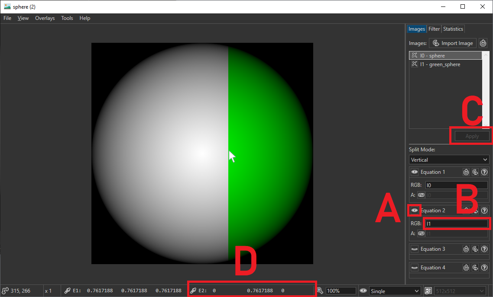
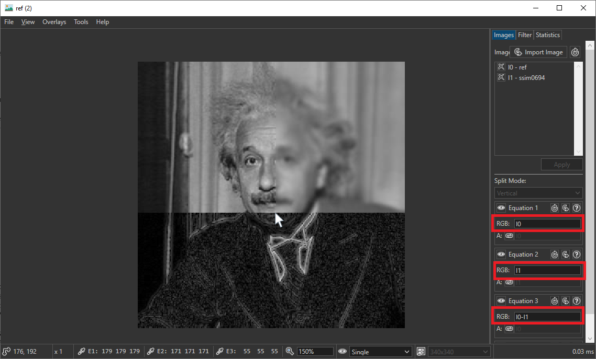
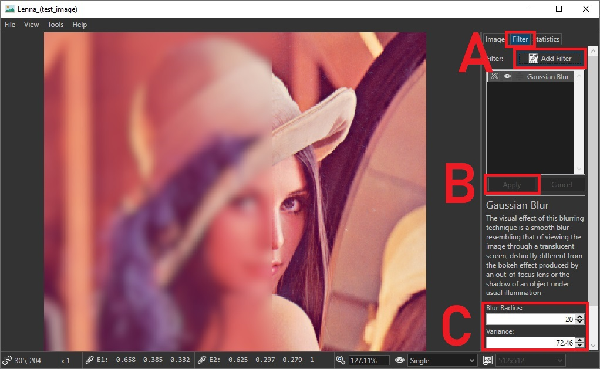

# Getting Started Guide

## Overview

* [Import Images](#compare-images)
* [Image Equations](#image-equations)
* [Export](#export)
* [Filter](#filter)
* [Statistics](#statistics) (MSE, SSIM)
* [Videos](#videos)
* [3D Images](#3d-images)

# Import Images

Images can be imported via File->Import (ctrl+i) in the menu bar or by using drag and drop. 
The imported images will be displayed on the right side of the editor in the "Images" tab:

* A: List of imported images
* B: Position of the mouse cursor in the image
* C: Color at the mouse cursors position (default: linear color values from 0.0 to 1.0). If you want to change the display format to 0-255, go to View->PixelDisplay in the menu and select 'byte (sRGB)'
* D: Zoom level (can be changed with the mouse wheel)

# Compare Images

When you import more than one image, you can compare them side by side in the editor:

* A: Click the 'eye' icon to toggle the visibility of another image equation. This equation will then be displayed on the right side of the cursor. The first equation will be on the left side of the cursor
* B: Change the image equation to 'I2', 'I3', 'I4' etc. to display a specific image from the import list. Apply the changes by hitting the 'Apply' button (C)
* D: The pixel colors of the second equation will be displayed next to the pixel colors of the first equation

You can compare up to four images in the image viewer. The position of the first, second, third and fourth image will be: top left, top right, bottom left, bottom right (relative to the cursor).
You can also fix the comparison position by double-clicking a position inside the image. This can be undone by double-clicking again.

If you work with .hdr files, you can adjust the exposure with the '+' and '-' keys. The current exposure is displayed in the status bar on the bottom (here: 'x1').

# Image Equations

The image equations can be used for per-pixel calculations. In the following example, the difference of two imported images in visualized:

Here, the third equation states 'I0-I1' which subtracts the pixel colors of I1 from I0. Alternatively, you can use 'abs(I0 - I1)' to display the absolute error or '(I0-I1)^2' to display the squared error. For more information and examples on the image equations, please refer to the [Equation Manual](equation.md).

Beware of a few things:
* Negative values will be displayed as if they were positive if View->DisplayAbsoluteValues is enabled (default).
* All values will be clamped between 0.0 and 1.0 in the status bar if any of the sRGB display modes are active. The default 'decimal' display mode will show negative numbers.

# Export

Before exporting, make sure that only a single image equation is visible (disable them by hitting the 'eye' symbol).
Select File->Export in the menu bar to start exporting:
* 1. Select a destination in the "Save as" dialog. Make sure to select the correct file type in the dropdown (.png .hdr etc.)
* 2. In the "Export" dialog you can select the desired pixel format and enable cropping if desired. The format specifies which components are saved (R=Red, G=Green, B=Blue, A=Alpha). If you work with a colored image without transparency, RGB8_SRGB should be the correct format. If you work with a grayscale image R8_SRGB can be sufficient. If you work with linear data (like normal maps or height fields) you might want to select a different data type (UNorm, SNorm, UFloat, SFloat). If you are not familiar with the different types of images formats you can refer to the [OpenGL wiki](https://www.khronos.org/opengl/wiki/Image_Format).

If you have made minor changes to the input image and you want to overwrite the image without changing the format, you can select the File->Overwrite from the menu bar.

The File->AnimatedDiff feature can generate an animed image comparison. For this, exactly two images need to be visible:

# Filter

Filter are HLSL compute shader that can be imported by the ImageViewer. Only a single function needs to be implemented that will be called for each pixel of the image. User defined parameters can be set from within the GUI. Some filter, like the gaussian blur, are already implemented and can be imported via the filter tab:

* A: switch to the filter tab and open a filter via 'Add Filter'
* B: press 'Apply' to apply the changes
* C: You can change the filter user parameters in the menu below

For more information on how to write your own filter, please refer to the [Filter Manual](filter_manual.md).

# Statistics

# Videos

# 3D Images